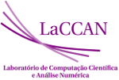

# CT-Energ
## Monitoramento Não-Intrusivo de Carga Elétrica e Identificação de Consumidores Individuais

> Repositório para os dados de carga recolhidos.

### Resumo CNPq - CTEnerg
Neste projeto desenvolveremos algoritmos de desagregação de energia através de Monitoramento Não Intrusivo e Intrusivo de Carga (NILM) usando análise de séries temporais, através da busca de padrões e de técnicas de teoria da informação, fusão de dados e dados detalhados do consumo de dispositivos obtidos por medidores e sensores a serem adquiridos neste projeto e fornecidos pelas operadoras de energia elétrica. Pesquisaremos o potencial de ferramentas de análise de sinais e teoria da informação na desagregação de energia. Tentaremos otimizar as técnicas de recuperação de informação e identificação de padrões em medição de alimentadores e de Unidades Consumidoras (UC) de Média Tensão (MT) e, possivelmente, em aplicações para prédios inteligentes.
